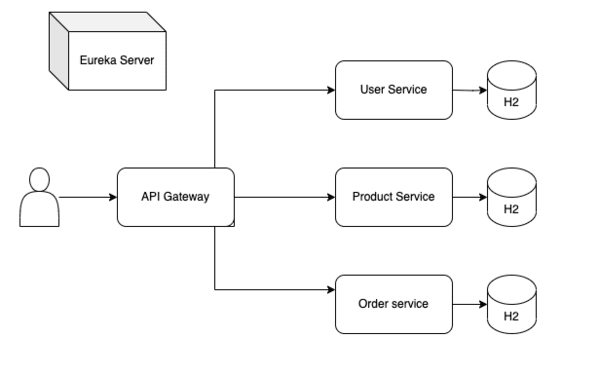

# Numarics Backend Monorepo

This monorepo contains several modules:

1. [User Service](user-service/README.md): Responsible for managing user registrations, login, and validation of JWT tokens. Upon registration, roles (ADMIN, USER) are assigned to users.

2. [Product Service](product-service/README.md): Manages product information. It provides endpoints for creating, searching, updating, and deleting products.

3. [Order Service](order-service/README.md): Manages CRUD operations for orders, ensuring that each order references a user and one or more products.

4. [Eureka Registry Server](eureka-server/README.md): Acts as a registry server for service discovery. It allows microservices to register themselves and discover other services in the system

5. [API Gateway](api-gateway/README.md): Serves as a centralized entry point for client requests. It routes requests to the appropriate microservice

