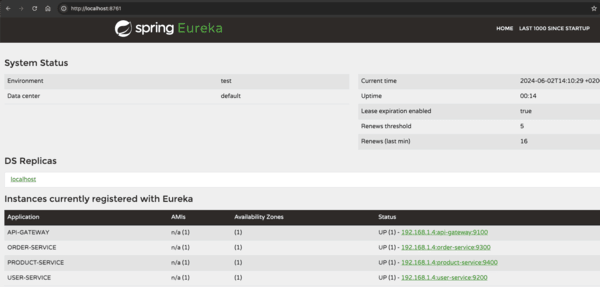

# Eureka Registry Server

## Overview

The Eureka Registry Server is a component of the Numarics Backend Monorepo project. It serves as a registry server for service discovery within a microservices architecture. This server is based on the Spring Cloud Netflix Eureka Server.

## Setup

Setting up this application locally involves following these steps:

- Clone root repository on your local instance
- From root of your repository execute `mvn compile` to download packages and build application
- Start application with `mvn spring-boot:run` command 
- Access the Eureka dashboard in your web browser: http://localhost:8761

