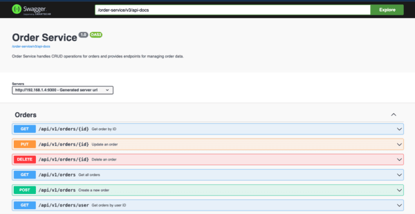

# Order Service
Order Service is responsible for managing orders within the application. It uses Spring Security and H2 database. An order references a user and one or more products. All users can create orders, but only the user who created the order or an ADMIN can view or modify it. Authentication is managed by calling the User Service via a Feign client to validate tokens, which return user roles. These roles are then checked in the security layer through a JwtRequestFilter.

## Setup

Setting up this application locally involves following these steps:

- Clone root repository on your local instance
- From root of your repository execute `mvn compile` to download packages and build application
- Start application with `mvn spring-boot:run` command

## Technologies Used

- **Spring Security:** Ensures secure authentication and authorization within the application.
- **H2 Database:** Provides an in-memory database solution for development and testing purposes.
- **Spring Boot Starter Validation:** Provides support for declarative validation constraints.
- **Spring Boot Starter Web:** Provides basic web support including RESTful APIs.
- **Spring Boot Starter Data JPA:** Simplifies the implementation of JPA-based data access layers.
- **Spring Cloud Starter Netflix Eureka Client:** Facilitates service registration and discovery in a distributed system.
- **Lombok:** Simplifies Java code by providing annotations to reduce boilerplate code.

## Logging
The Order Service uses SLF4J for logging, providing detailed information about service operations.

## Authentication and Authorization:

To authenticate users, the Order Service uses a Feign client to validate JWT tokens via the User Service. This allows the service to determine the user's role, which is then utilized by the JwtRequestFilter for access control.
Furthermore, the Order Service communicates with the Product Service for create/update request.
The OrderAuthorizationFilter handles permissions for order operations.

## Swagger
To access Swagger documentation, you can use the following URL:

- OpenAPI Specification: `http://localhost:9300/order-service/v3/api-docs`

- Access Swagger UI: `http://localhost:9300/order-service/swagger-ui/index.html`

  
