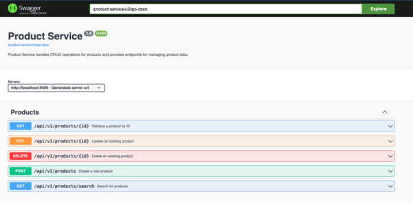

# Product Service
Product Service manages product information. It provides endpoints for creating, searching, updating, and deleting products.

## Setup

Setting up this application locally involves following these steps:

- Clone root repository on your local instance
- From root of your repository execute `mvn compile` to download packages and build application
- Start application with `mvn spring-boot:run` command

- The service will start up on port 9400 by default.

## Endpoints
The following endpoints are available in the Product Service:

- Create Product: POST /api/v1/products - Creates a new product. Only users with the ADMIN role can access this endpoint.
- Get Product by ID: GET /api/v1/products/{id} - Retrieves product details by ID. Accessible to all users.
- Search Products: GET /api/v1/products/search - Searches and filters products by name, description, and/or category. Accessible to all users.
- Update Product: PUT /api/v1/products/{id} - Updates an existing product. Only users with the ADMIN role can access this endpoint.
- Delete Product: DELETE /api/v1/products/{id} - Deletes a product by ID. Only users with the ADMIN role can access this endpoint.

## Technologies Used
- **Spring Security:** Ensures secure authentication and authorization within the application.
- **Spring Data JPA:** Enables interaction with the database using the Java Persistence API.
- **H2 Database:** Provides an in-memory database solution for development and testing.
- **Spring Boot Starter Validation:** Provides support for declarative validation constraints.
- **Lombok:** Simplifies Java code by providing annotations to reduce boilerplate code.
- **Spring Cloud Starter Netflix Eureka Client:** Facilitates service registration and discovery in a distributed system.
- **Feign Client:** Enables declarative REST client bindings.

## Logging
The Product Service uses SLF4J for logging, providing detailed information about service operations.

## Authentication and Authorization:
To authenticate users, the product service uses a Feign client to communicate with the user-service. This communication involves calling an endpoint responsible for validating JWT tokens. Upon validation, the response includes the user's role, which is then utilized within the security layer, specifically the JwtRequestFilter, to verify access control based on the user's role.

## Swagger
To access Swagger documentation, you can use the following URL:

- OpenAPI Specification: `http://localhost:9400/product-service/v3/api-docs`

- Access Swagger UI: `http://localhost:9400/product-service/swagger-ui/index.html`

