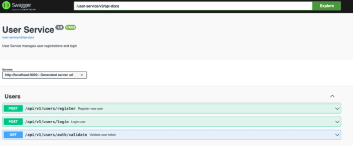

# User Service
User Service is responsible for managing user registrations, login and validation of JWT token. It uses Spring Security and H2 database. Upon registration, roles (e.g., ADMIN, USER) are assigned to users.

## Setup

Setting up this application locally involves following these steps:

- Clone root repository on your local instance
- Navigate to the user-service folder and execute `mvn compile` to download packages and build application
- Start application with `mvn spring-boot:run` command

The service will start up on port 9200 by default.

## Technologies Used

- **Spring Security:** Ensures secure authentication and authorization within the application.
- **H2 Database:** Provides an in-memory database solution for development and testing purposes.
- **ModelMapper:** Facilitates mapping between entity and DTO objects.
- **Spring Boot Starter Validation:** Provides support for declarative validation constraints.
- **Spring Boot Starter Web:** Provides basic web support including RESTful APIs.
- **Spring Boot Starter Data JPA:** Simplifies the implementation of JPA-based data access layers.
- **JSON Web Token (JWT):** Enables secure communication by generating and validating tokens.
- **Lombok:** Simplifies Java code by providing annotations to reduce boilerplate code.

## Logging
The User Service uses SLF4J for logging, providing detailed information about service operations.

## Swagger
To access Swagger documentation, you can use the following URL:

- OpenAPI Specification: `http://localhost:9200/user-service/v3/api-docs`

- Access Swagger UI: `http://localhost:9200/user-service/swagger-ui/index.html`

